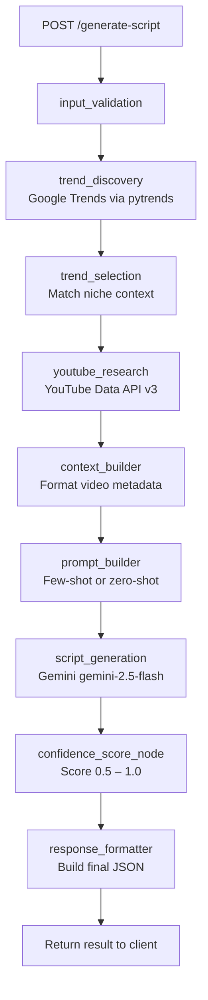

# AI Trend Script Agent

An agentic AI system that fetches trending topics from Google Trends, researches them via YouTube, and generates complete YouTube scripts using Google Gemini — all orchestrated through a LangGraph pipeline and exposed via a FastAPI REST endpoint.

---

## Architecture



---

## Tech Stack

| Layer | Technology |
|---|---|
| Backend Framework | FastAPI (Python) |
| Agent Orchestration | LangGraph |
| LLM Provider | Google Gemini (`gemini-2.5-flash`) |
| Trend Discovery | pytrends (Google Trends) |
| Video Research | YouTube Data API v3 |
| Environment Variables | python-dotenv |

---

## Folder Structure

```
ai-trend-script-agent/
│
├── app/
│   ├── main.py               # FastAPI app + endpoints
│   ├── config.py             # Env var loading
│   │
│   ├── agent/
│   │   ├── state.py          # ScriptAgentState TypedDict
│   │   ├── nodes.py          # All 9 LangGraph node functions
│   │   └── graph.py          # Graph construction + compile
│   │
│   ├── services/
│   │   ├── trends.py         # Google Trends fetch
│   │   ├── youtube.py        # YouTube search
│   │   └── llm.py            # Claude API + parser
│   │
│   ├── models/
│   │   └── schema.py         # Pydantic request/response models
│   │
│   └── prompts/
│       └── fewshot_prompt.md # 3 example YouTube scripts
│
├── demo_outputs/
│   ├── script_india.txt      # Sample: IN/tech/AI tools
│   ├── script_usa.txt        # Sample: US/finance/Bitcoin
│   └── script_ai.txt         # Sample: US/tech/AI coding
│
├── generate_samples.py       # Helper script to generate sample files
├── requirements.txt
├── README.md
├── .env                      # NOT committed (see .gitignore)
└── .gitignore
```

---

## Setup Instructions

### 1. Clone the repository

```bash
git clone https://github.com/your-username/ai-trend-script-agent.git
cd ai-trend-script-agent
```

### 2. Create a virtual environment

```bash
python -m venv venv

# Activate on Windows:
venv\Scripts\activate

# Activate on Mac/Linux:
source venv/bin/activate
```

### 3. Install dependencies

```bash
pip install -r requirements.txt
```

### 4. Configure environment variables

Create a `.env` file in the project root:

```
GEMINI_API_KEY=your_gemini_key_here
YOUTUBE_API_KEY=your_youtube_key_here
```

> **Note:** API keys are never hardcoded. The `.env` file is listed in `.gitignore` and must never be committed to version control.

### 5. Start the server

```bash
uvicorn app.main:app --reload
```

The server starts at `http://localhost:8000`

Open Swagger UI at: `http://localhost:8000/docs`

### 6. Generating Demo Samples

You can also use the included standalone script to automatically generate sample scripts without running the web server. It invokes the LangGraph pipeline directly and saves the JSON output to the `demo_outputs` folder:

```bash
python generate_samples.py
```

---

## API Reference

### `GET /health`

Returns server status.

**Response:**
```json
{"status": "ok"}
```

---

### `POST /generate-script`

Generates a complete YouTube script based on trending topics and YouTube research.

**Query Parameters:**
- `mock` (bool, default: `false`) — Return a hardcoded sample response for demo purposes

**Request Body:**
```json
{
  "country": "IN",
  "topic_category": "tech",
  "niche_context": "AI tools for developers",
  "prompt_strategy": "few_shot"
}
```

| Field | Type | Required | Description |
|---|---|---|---|
| `country` | string | Yes | Country code: `IN`, `US`, `UK` |
| `topic_category` | string | Yes | Topic domain: `tech`, `finance`, `entertainment` |
| `niche_context` | string | No | Keywords for trend filtering |
| `prompt_strategy` | string | No | `few_shot` (default) or `zero_shot` |

**Response:**
```json
{
  "trend": "OpenAI Sora",
  "confidence_score": 0.90,
  "youtube_references": [
    {
      "title": "Sora AI Explained",
      "description": "OpenAI's video generation model explained",
      "channel": "AI Daily"
    }
  ],
  "generated_script": {
    "hook": "AI just changed filmmaking forever — and most people missed it.",
    "intro": "OpenAI released Sora, a model that generates cinematic video from text prompts...",
    "body": "Creators can now produce realistic scenes without cameras or actors...",
    "outro": "Subscribe for more AI updates."
  },
  "prompt_strategy": "few_shot",
  "generated_at": "2026-03-06T10:00:00+00:00"
}
```

#### Safe Demo Mode

To test without consuming API quota:

```
POST /generate-script?mock=true
```

Returns a hardcoded sample response with realistic content.

---

## Prompt Strategy Comparison

| Strategy | Description | Script Quality |
|---|---|---|
| `zero_shot` | Simple prompt with no examples | Generic, less structured |
| `few_shot` | Loads 3 example scripts from `fewshot_prompt.md` | Follows consistent structure and style |

The `few_shot` strategy consistently produces higher-quality output because Gemini follows the established structure and tone of the example scripts rather than generating generic content.

---

## Sample Output

From `demo_outputs/script_ai.txt`:

```json
{
  "trend": "OpenAI Sora",
  "confidence_score": 0.9,
  "generated_script": {
    "hook": "A 60-second Hollywood-quality video, generated entirely from text in under a minute...",
    "intro": "OpenAI's Sora represents the most significant leap in AI video generation to date...",
    "body": "Advertisers are already replacing traditional video shoots with Sora-generated footage...",
    "outro": "Will you use Sora to create your next video? Comment below and subscribe..."
  }
}
```

---

## Fallback Behavior

The agent is resilient to API failures:

- **Google Trends unavailable** → Falls back to `FALLBACK_TRENDS` list (5 curated AI/tech topics)
- **YouTube API quota exceeded** → Falls back to `MOCK_VIDEOS` list (3 representative video entries)

Both fallbacks activate automatically with no user intervention required.

---

## Demo Video

> _Record a demo showing zero-shot vs few-shot comparison and add the link here._

---

## License

MIT
